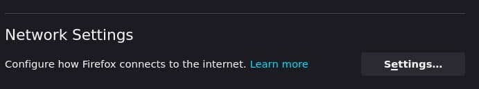
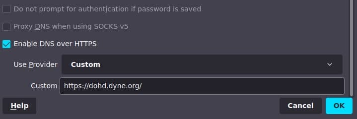
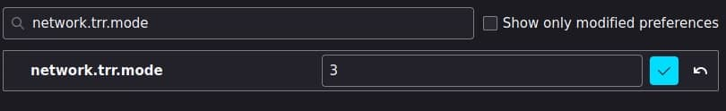
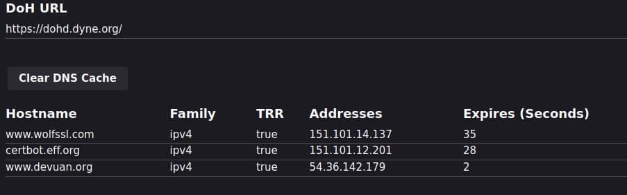

# Configure DoHD.dyne.org on your browser

There are several browsers compatible with DNS over HTTPS (DoH). This protocol lets you encrypt your connection to dohd.dyne.org in order to protect your DNS queries from privacy intrusions and tampering.

## Mozilla Firefox

1. Click the menu button.
1. Select **Settings**.
1. In the **General** menu, scroll down to access **Network Settings**.

1. Click on the **Settings** button.
1. Click **Enable DNS over HTTPS**. Use provider **Custom** and write **https://dohd.dyne.org**.

1. Then go to Firefox **about:config**

1. And search for **network.trr.mode** then set it to **2** or **3** (meaning [Only use TRR, never use the native resolver](https://wiki.mozilla.org/Trusted_Recursive_Resolver))

1. Enjoy DOHD!

## Google Chrome

1. Click on the three-dot menu in your browser window.
1. Select **Settings**.
1. Scroll down to **Privacy and security** > **Security**.
1. Scroll down and enable the **Use secure DNS** switch.
1. Choose a service provider and write **https://dohd.dyne.org**.

## Microsoft Edge

1. Go to `edge://settings/privacy`.
1. Scroll down to the **Security** section.
1. Make sure the **Use secure DNS** option is enabled.
1. Choose a service provider and write **https://dohd.dyne.org**.

## Brave

1. Click the menu button in your browser window.
1. Navigate to **Settings**.
1. On the left side of the menu, scroll down and click **Additional settings**.
1. Navigate to **Privacy and security** > **Security**.
1. Enable **Use secure DNS**.
1. Click **With Custom** and write **https://dohd.dyne.org**.

## How to check if my browser is configured correctly?

1. Visit [1.1.1.1 help page](https://1.1.1.1/help).
1. Verify that `Using DNS over HTTPS (DoH)` is `Yes`.

