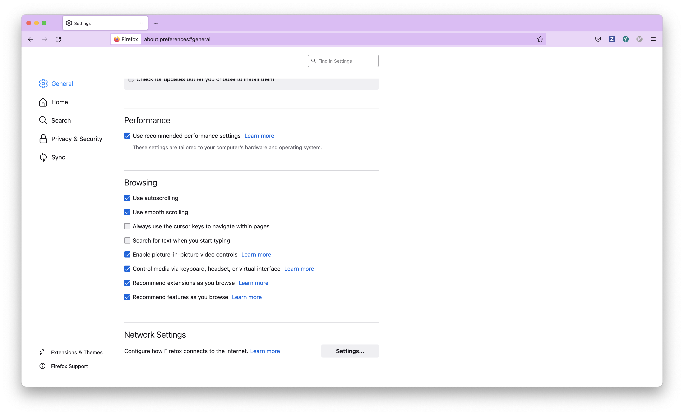
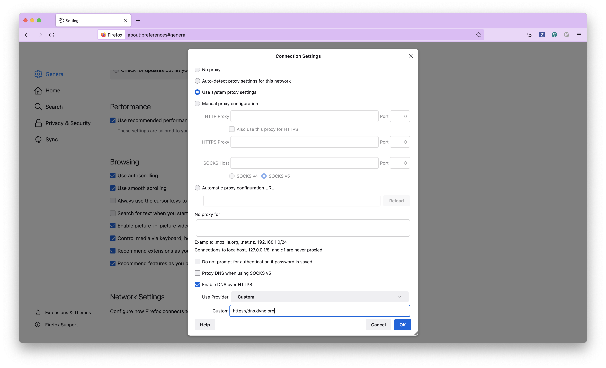
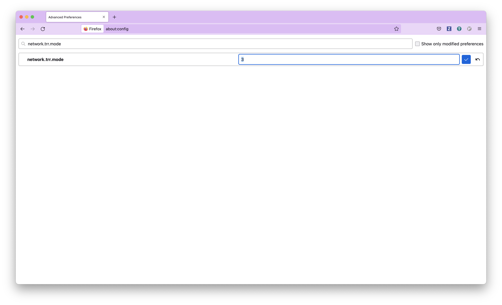
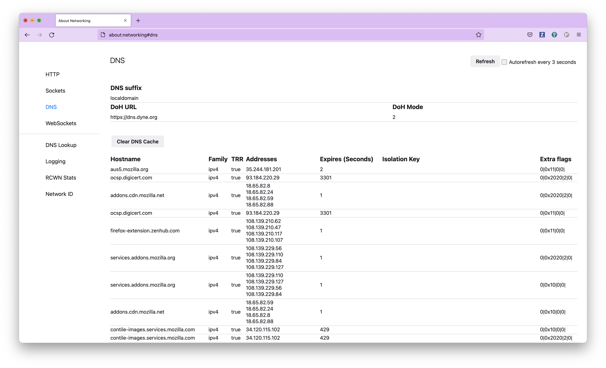

# Configure dns.dyne.org on your browser

There are several browsers compatible with DNS over HTTPS (DoH). This protocol lets you encrypt your connection to dns.dyne.org in order to protect your DNS queries from privacy intrusions and tampering.

## Mozilla Firefox

1. Navigate to [about:preferences#general](about:preferences#general)
1. Scroll down to access **Network Settings**.

1. Click on the **Settings** button.
1. Click **Enable DNS over HTTPS**. Use provider **Custom** and write **https://dns.dyne.org**.

1. Then go to Firefox [about:config](about:config)
1. And search for **network.trr.mode** then set it to **2** or **3** (meaning [Only use TRR, never use the native resolver](https://wiki.mozilla.org/Trusted_Recursive_Resolver))

1. Enjoy DOHD! See it works from [about:networking](about:networking)

## Google Chrome

1. Navigate to [chrome://settings/security](chrome://settings/security)
1. Scroll down and enable the **Use secure DNS** switch.
1. Click **With Customised** and write **https://dns.dyne.org**

## Microsoft Edge

1. Go to `edge://settings/privacy`.
1. Scroll down to the **Security** section.
1. Make sure the **Use secure DNS** option is enabled.
1. Choose a service provider and write **https://dns.dyne.org**.

## Brave

1. Navigate to [brave://settings/security](brave://settings/security)
1. Enable **Use secure DNS**.
1. Click **With Customised** and write **https://dns.dyne.org**

